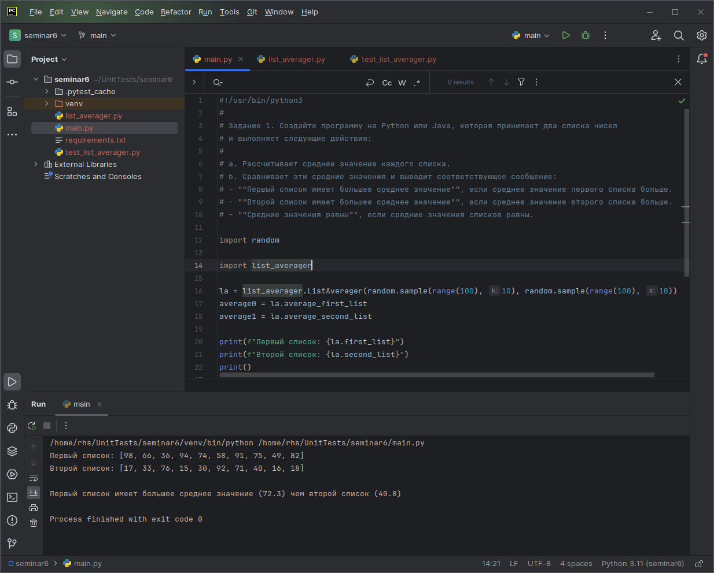
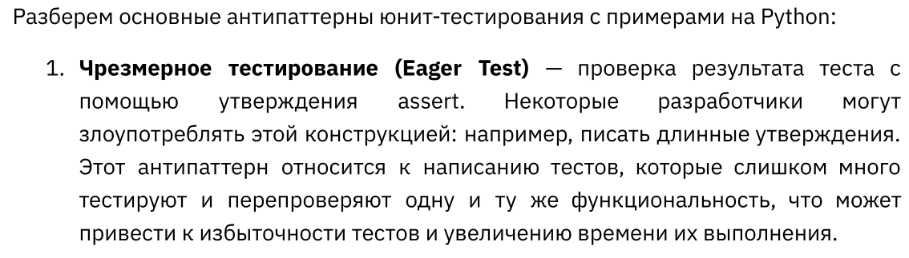
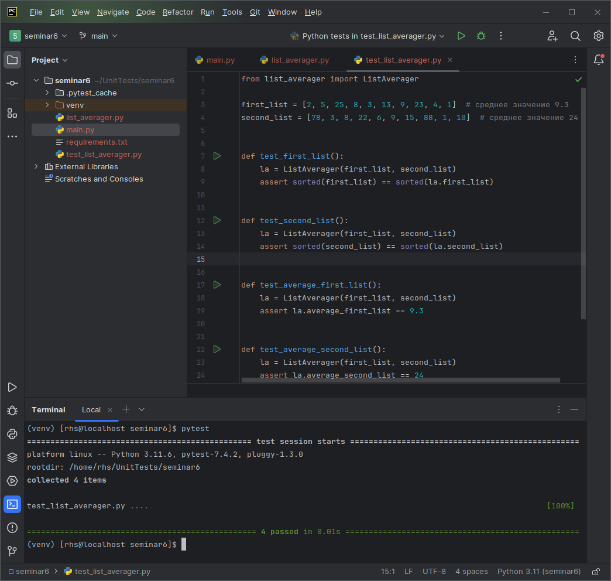

## Задание к промежуточной аттестации по курсу "Unit-тесты" было такое:

*Создайте программу на Python или Java, которая принимает два списка чисел и выполняет следующие действия:*
1. *Рассчитывает среднее значение каждого списка.*
1. *Сравнивает эти средние значения и выводит соответствующее сообщение:*
    - *"Первый список имеет большее среднее значение", если среднее значение первого списка больше.*
    - *"Второй список имеет большее среднее значение", если среднее значение второго списка больше.*
    - *"Средние значения равны", если средние значения списков равны.*

Программу я написал, её вывод таков:

Далее в задании было отмечено:

*Важно:
Приложение должно быть написано в соответствии с принципами объектно-ориентированного программирования.
Используйте Pytest (для Python) или JUnit (для Java) для написания тестов, которые проверяют правильность работы программы. Тесты должны учитывать различные сценарии использования вашего приложения.*

Программу я сделал на языке `Python`. Она состоит из двух модулей. Модуль `main.py` сама программа и модуль `list_averager.py` содержит класс, в который и загружаются оба списка и который имеет методы для вычисления среднего значения для этих списков.

Тестами я покрыл только сам класс, то есть модуль `list_averager.py` так как не вижу никакого смысла покрывать тестами саму программу, которая просто использует при помощи самого обычного сравнения те данные, которые возвращает ей класс `ListAverager`, там просто нечего тестировать. Если бы я сделал тесты ещё и этого, то получился бы антипаттерн тестирования под названием "Чрезмерное тестирование", от которого нас предостерегали на последней лекции, я бы дважды тестировал то же самое, что уже протестировал в модульных тестах для класса `ListAverager`:

Ещё далее в задании было отмечено:

*Используйте pylint (для Python) или Checkstyle (для Java) для проверки качества кода.*

но на семинаре было сказано что это делать не обязательно. Поэтому это я не делал.

Так же в задании говорилось:

*Сгенерируйте отчет о покрытии кода тестами. Ваша цель - достичь минимум 90% покрытия.*

Покрытие тестами класса `ListAverager` у меня получилось 100%:

В классе `ListAverager` всего четыре функции, поэтому удалось протестировать их все и достичь стопроцентного покрытия тестами.
